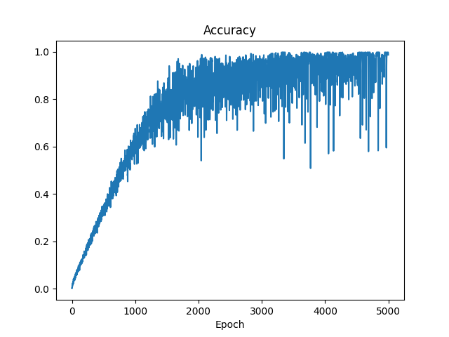

# Vision-SSL: SimCLR and MAE's
> An implementation of Self-Supervised techniques for computer vision tasks, namely Simple Contrastive Learning of visual Representations (SimCLR) and Masked Autoencoders (MAE).

### Directions to run code: 
The files [simclr.ipynb](https://github.com/shreshth3000/Vision-SSL/blob/main/simclr.ipynb) and [mae.ipynb](https://github.com/shreshth3000/Vision-SSL/blob/main/mae.ipynb) are the source files for the SimCLR and MAE implementations, respectively. To run, import the ssl_dataset file into this directory after cloning (So that at least validation data is available to train the linear probe).

#### Requirements (I Used): 

**Use the pytorch installation command from [pytorch.org](https://pytorch.org/get-started/locally/) depending on your system**
```
pip install torch torchvision torchaudio --index-url https://download.pytorch.org/whl/cu126
pip install matplotlib pillow scikit-learn
```


The 2 options to run the code:
* Run all cells in each, thereby regenerating the simclr_encoder.pth and mae_encoder.pth files, which requires extensive compute.
* Run all but the pretraining cells (marked in the code), which will reduce runtime. This is possible due to the saved weight files.
---
# RESULTS AND INTERPRETATIONS

#### Performance:
|**Metric**|**MAE**|**SimCLR**|
|----------|-------|----------|
|Accuracy (%)|85.44|86.72|
|F1|0.8642|0.8567|

### SimCLR:
#### * **Linear Probe Accuracy:** 86.72%
#### * **Linear Probe F1 score:** 0.8642

<p float="left">
  
  
</p>


**The SimCLR loss and accuracy curve display tendencies of fitting the noise in the data (overfitting) due to their erratic/oscillatory nature near the end of the training cycle.
This may indicate inadequate pretraining or a flawed architecture for the linear probe.**


### MAE:
#### * **Linear Probe Accuracy:** 85.44%
#### * **Linear Probe F1 score:** 0.8567

<p float="left">
  
  
</p>


**The MAE loss and accuracy curves are comparatively much smoother, representing stable pretraining and convergence. Similar performance at lower compute costs are the benefits of using the MAE here, along with other specialised tasks like image restoration.**


> **Both Models display similar results, with SimCLR performing slightly better, albeit against an lightweight MAE that has been trained for fewer epochs due to computational limits.**


